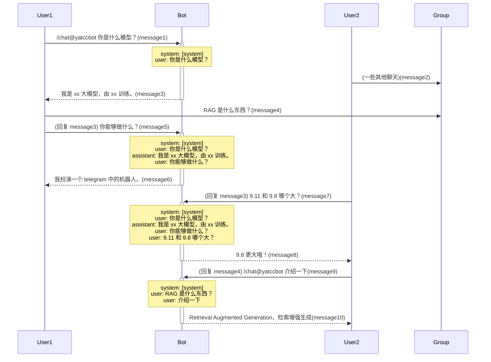

# Yet Another Tree Context Chat Bot

**快速体验** [@yatccbot](https://t.me/yatccbot)

## 特点

1. 此 Bot 工作在 [隐私模式](https://core.telegram.org/bots/features#privacy-mode) 下, 它不关心 (也不会收到) 除上下文外的任何消息
2. 流式对话，响应迅速
3. 请使用 `/chat` + prompt, 或者对任意消息 (作为 prompt) 回复 `/chat` 以开始对话
4. 回复 Bot 的消息 (作为上下文) 以继续对话, 该上下文保存 7 天

## FAQ

### 对话的上下文机制是怎样的？

> [!NOTE]
> 假定系统消息为 [system]

### 为什么这么设计？

由于本 Bot 工作在隐私模式下，根据 telegram 的描述，它仅能收到以下类型的消息

> - Commands explicitly meant for them (e.g., /command@this_bot).
> - General commands (e.g. /start) if the bot was the last bot to send a message to the group.
> - Inline messages sent via the bot.
> - Replies to any messages implicitly or explicitly meant for this bot.

并且群聊往往多人会同时进行复数个话题，笼统作为上下文难以区分

以每个对话线程作为上下文，可以较好地进行多人并行对话

每个用户可以随时 "fork" 一个对话线程，保持上下文独立不互相打扰，正如 *Tree Context*

### 为什么要使用隐私模式？

> This mode not only increases user privacy, but also makes the bot more efficient by reducing the number of inputs it needs to process. Users can always see a bot’s current privacy setting in the list of group members.

### 为什么上下文只能保存 7 天

由于 telegram API 的特点，`reply_message` 并不能递归获取，因此 Bot 需要自行存储上下文，无疑会带来一定成本

而即时通讯软件中，大部分的消息有效期都不会超过 7 天，因此设此限制

## Terms and License

- [deepseek r1 distill qwen 32b](https://github.com/deepseek-ai/DeepSeek-R1/blob/main/LICENSE)
- [qwen 1.5 14b](https://github.com/QwenLM/Qwen/blob/main/LICENSE)
- [llama 3.3 70b](https://github.com/meta-llama/llama-models/blob/main/models/llama3_3/LICENSE)
- [gemma 7b](https://ai.google.dev/gemma/terms)

## License

本项目使用 [AGPL-3.0 license](./LICENSE)
